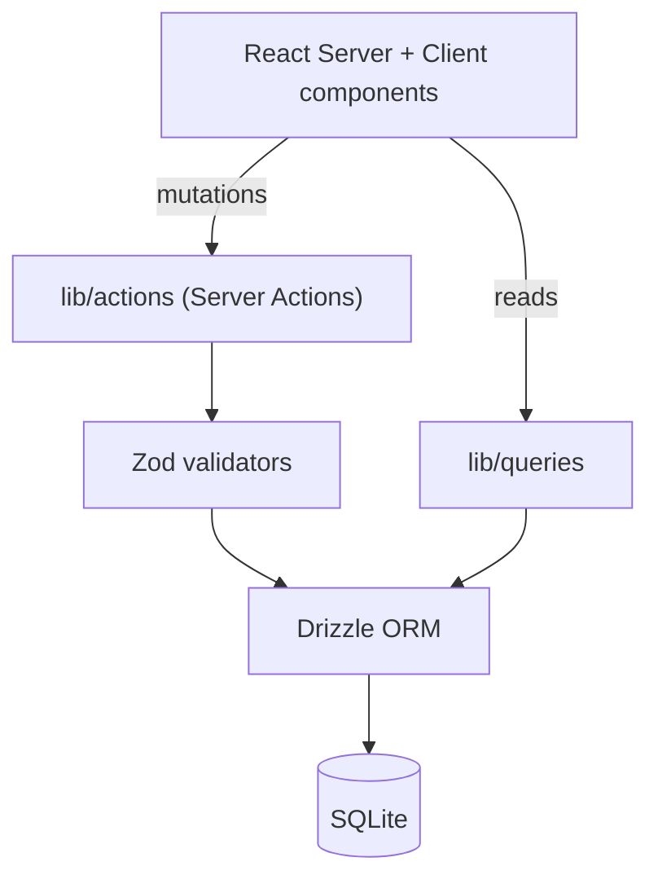
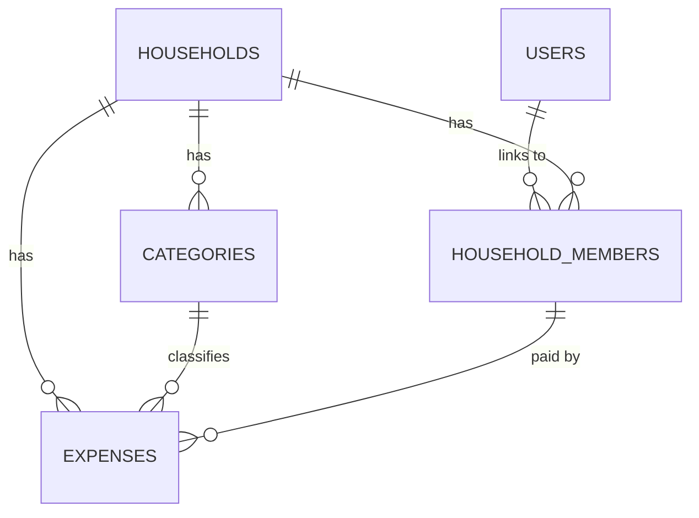

# HomeExpense

A collaborative household expense tracker. Every family or flat member can log
shared expenses, organize them by category, assign them to a member, and see
where the money goes on a charted dashboard.

Built with **Next.js 16** (App Router, Server Components and Server Actions),
**Drizzle ORM + SQLite**, **Auth.js**, and **shadcn/ui**.

## Features

- **Households and members** with roles (admin / member)
- **Expense tracking** by category and member, in a configurable currency
- **Category management** with icons and colors
- **Dashboard** with spend breakdowns and charts (Recharts)
- **Settings** for household and preferences
- **Dark / light** theme, responsive layout, PWA manifest

## Tech stack

| Area | Choice |
|------|--------|
| Framework | Next.js 16 (App Router, React 19, Server Actions) |
| Language | TypeScript (strict) |
| Database | SQLite via better-sqlite3 + Drizzle ORM |
| Validation | Zod |
| UI | Tailwind CSS 4 + shadcn/ui |
| Charts | Recharts |
| Auth | Auth.js (Google) |

## Architecture

Reads go through query functions; writes go through Server Actions. No REST layer.



## Data model



## Getting started

```bash
pnpm install

# create the SQLite database and apply the schema
pnpm db:push
pnpm db:init      # seed default data

pnpm dev          # http://localhost:3000
```

Set the Auth.js / Google environment variables in `.env.local` before using sign-in.

### Useful scripts

| Script | What it does |
|--------|--------------|
| `pnpm dev` | Start the dev server |
| `pnpm build` / `pnpm start` | Production build / serve |
| `pnpm db:generate` | Generate Drizzle migrations from the schema |
| `pnpm db:push` | Apply the schema to the database |
| `pnpm db:init` | Seed default categories / data |
| `pnpm lint` | Lint |

## Project structure

```
src/
  app/
    (auth)/        login
    (app)/         dashboard, expenses, categories, members, settings
  components/      ui (shadcn), layout, dashboard, expenses, categories, members, shared
  lib/
    db/            connection, schema, seed
    actions/       Server Actions (mutations)
    queries/       data fetching (reads)
    validators/    Zod schemas
  hooks/           custom React hooks
```

## Notes

Uses a local SQLite file, so it runs and self-hosts cleanly. Google sign-in is
wired through Auth.js.
