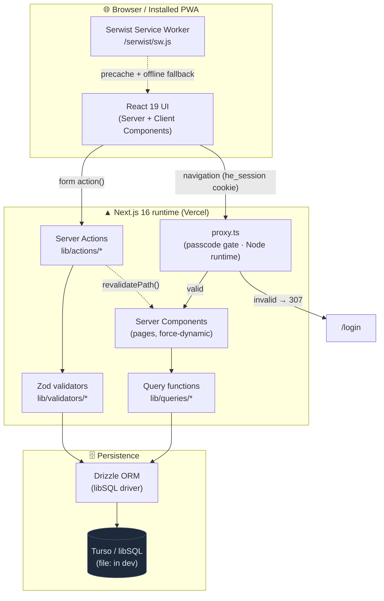
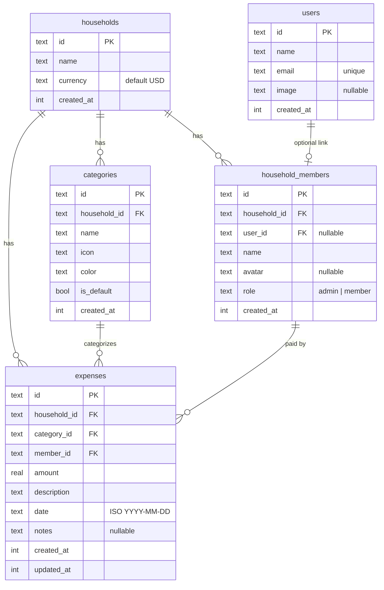
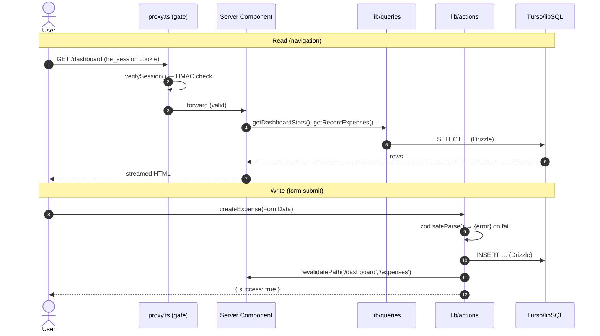
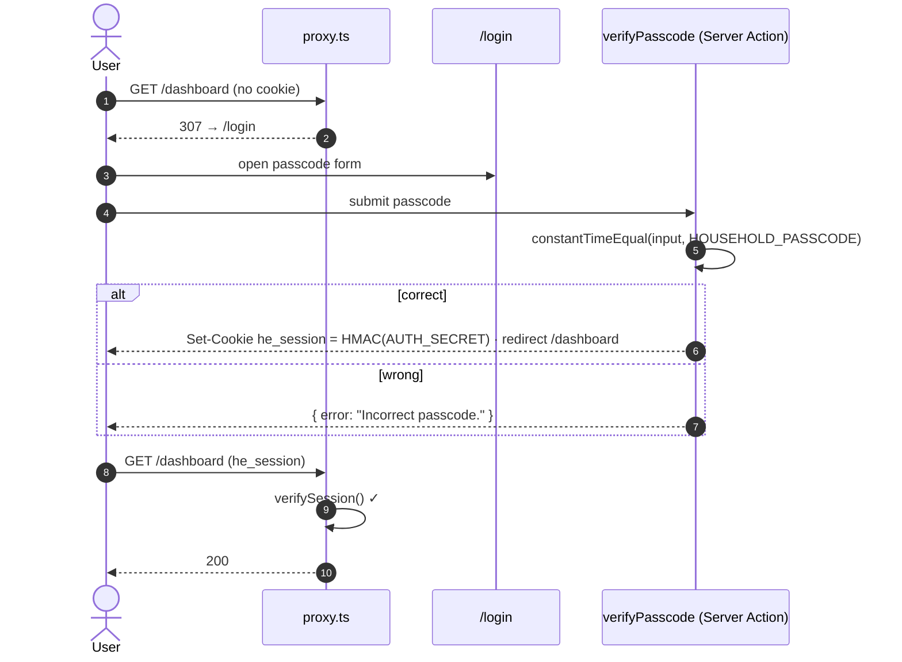

# HomeExpense

A collaborative household expense‑tracking **Progressive Web App**. Every member of a home
logs shared expenses, organizes them by category and person, and sees where the money goes on
a charts‑driven dashboard — installable to a phone home screen and usable offline.

> **Status:** single‑household deployment, protected by a shared passcode. Real per‑user
> Google accounts and multi‑household support are deferred (see [Roadmap](#roadmap)).

---

## Table of Contents

- [Features](#features)
- [Tech Stack](#tech-stack)
- [Architecture](#architecture)
  - [System Overview](#system-overview)
  - [Data Model](#data-model)
  - [Request & Mutation Lifecycle](#request--mutation-lifecycle)
  - [Access Gate](#access-gate)
- [Project Structure](#project-structure)
- [Getting Started](#getting-started)
- [Database & Migrations](#database--migrations)
- [API Reference (Server Actions & Queries)](#api-reference-server-actions--queries)
- [HTTP Routes](#http-routes)
- [Environment Variables](#environment-variables)
- [Deployment](#deployment)
- [PWA / Offline](#pwa--offline)
- [Scripts](#scripts)
- [Roadmap](#roadmap)

---

## Features

| Area | Capability |
|---|---|
| **Dashboard** | Monthly total, daily average, transaction count, month‑over‑month change; 30‑day spending bar chart; category donut chart; recent‑expense feed. |
| **Expenses** | Full create / edit / delete; filter by category, member, and date range; grouped‑by‑date list. |
| **Categories** | Manage categories with icon + color pickers and per‑category expense counts. |
| **Members** | Manage household members with roles (`admin` / `member`), avatars, and per‑member spend stats. Members with existing expenses cannot be deleted. |
| **Access** | Shared‑passcode gate over all app routes (HMAC‑signed, HttpOnly cookie). |
| **PWA** | Installable, offline‑capable (Serwist service worker + precached offline fallback). |
| **Theming** | Light / dark / system via `next-themes`. |

---

## Tech Stack

| Layer | Technology |
|---|---|
| Framework | **Next.js 16** (App Router, React 19, Server Components, Server Actions, Turbopack) |
| Language | **TypeScript 6** (strict) |
| Styling | **Tailwind CSS v4** + **shadcn/ui** (base‑nova style, OKLCH colors) on **Base UI** |
| Database | **Turso / libSQL** via **Drizzle ORM** (`drizzle-orm/libsql`) — local dev uses a `file:` SQLite DB through the same driver |
| Validation | **Zod v4** |
| Charts | **Recharts 3** |
| Dates | **date-fns v4** |
| PWA | **@serwist/turbopack** (service worker + offline) |
| IDs | **cuid2** |

---

## Architecture

HomeExpense follows the Next.js App Router data‑flow convention: **reads** happen in Server
Components via `lib/queries`, and **writes** happen through Server Actions in `lib/actions`
(Zod‑validated, then `revalidatePath`). There are no REST/CRUD API routes.

### System Overview



### Data Model

Five tables, all with `cuid2` string primary keys and integer (Unix‑epoch) timestamps. The
`expenses` table is the hub, referencing the household, a category, and the member who paid.



### Request & Mutation Lifecycle



### Access Gate

The app is single‑tenant and protected by one shared passcode. `proxy.ts` (Next.js 16's
renamed middleware, Node runtime) guards every route except `/login`, the offline page, and
static assets. The session cookie is a constant payload signed with **HMAC‑SHA256** via the
Web Crypto API — no JWT library, and the same helper runs in the proxy and the Server Action.



---

## Project Structure

```
src/
├── app/
│   ├── (auth)/login/         # passcode login page
│   ├── (app)/                # gated app (force-dynamic layout)
│   │   ├── dashboard/        # charts + summary
│   │   ├── expenses/         # list · new · [id]/edit
│   │   ├── categories/       # category manager
│   │   ├── members/          # member manager
│   │   └── settings/
│   ├── serwist/[path]/       # service-worker route handler
│   ├── ~offline/             # precached offline fallback
│   ├── sw.ts                 # Serwist service worker source
│   └── layout.tsx            # root layout + SerwistProvider
├── components/
│   ├── ui/                   # shadcn/Base UI primitives (CLI-managed)
│   ├── layout/ dashboard/ expenses/ categories/ members/ shared/ auth/
├── lib/
│   ├── db/                   # Drizzle schema, libSQL connection, seed
│   ├── queries/              # READ functions (Server Components)
│   ├── actions/              # WRITE Server Actions
│   ├── validators/           # Zod schemas
│   ├── gate.ts               # Web Crypto HMAC sign/verify
│   └── auth.ts               # mock session (display only)
├── hooks/
└── proxy.ts                  # passcode gate (Next 16 proxy)
drizzle/                      # generated SQL migrations
```

---

## Getting Started

Requires **pnpm** and **Node 20+**.

```bash
pnpm install
cp .env.example .env.local        # then edit values (passcode, secret)
pnpm db:init                      # apply migrations + seed sample data
pnpm dev                          # http://localhost:3000
```

Log in with the `HOUSEHOLD_PASSCODE` you set in `.env.local`. The local database is a SQLite
file at `data/expense.db` (gitignored) accessed through the libSQL driver.

---

## Database & Migrations

- **Schema:** `src/lib/db/schema.ts` (Drizzle `sqlite-core`) — single source of truth.
- **Migrations:** generated into `drizzle/` with `pnpm db:generate`, applied with `pnpm db:migrate`.
- **Seed:** `pnpm db:seed` runs `src/lib/db/seed.ts` (idempotent — skips if a household exists),
  creating a default household, one member, 12 categories, and 15 sample expenses.
- **Driver:** one driver for both worlds — `file:./data/expense.db` locally, `libsql://…` +
  auth token in production.

> Pages that read the database export `dynamic = "force-dynamic"` (via the `(app)` layout), so
> the production build never touches the database and works in CI without a pre‑seeded DB.

---

## API Reference (Server Actions & Queries)

> **There is no REST API.** Mutations are **Server Actions** (`"use server"`), invoked directly
> from client components via the form `action` prop; reads are plain async functions called
> inside Server Components. Every mutation validates with Zod and returns
> `{ success: true }` or `{ error: string }`.

### Mutations — `src/lib/actions/`

| Action | Signature | Input (FormData unless noted) | Returns | Revalidates |
|---|---|---|---|---|
| `createExpense` | `(formData)` | `amount, description, categoryId, memberId, date, notes?` | `{success}` \| `{error}` | `/dashboard`, `/expenses` |
| `updateExpense` | `(id, formData)` | same as create | `{success}` \| `{error}` | `/dashboard`, `/expenses` |
| `deleteExpense` | `(id)` | — | `{success}` | `/dashboard`, `/expenses` |
| `createCategory` | `(formData)` | `name, icon, color` | `{success}` \| `{error}` | `/categories`, `/expenses` |
| `updateCategory` | `(id, formData)` | `name, icon, color` | `{success}` \| `{error}` | `/categories`, `/expenses` |
| `deleteCategory` | `(id)` | — | `{success}` \| `{error}` (blocked if expenses exist) | `/categories` |
| `createMember` | `(formData)` | `name, role` | `{success}` \| `{error}` | `/members`, `/expenses` |
| `updateMember` | `(id, formData)` | `name, role` | `{success}` \| `{error}` | `/members` |
| `deleteMember` | `(id)` | — | `{success}` \| `{error}` (blocked if expenses exist) | `/members` |
| `verifyPasscode` | `(prevState, formData)` | `passcode` | sets `he_session` + redirect, or `{error}` | — |

**Validation schemas** (`src/lib/validators/`): `expenseSchema` (amount > 0, description 1–200,
required `categoryId`/`memberId`/`date`, notes ≤ 500), `categorySchema` (name 1–50, icon, color),
`memberSchema` (name 1–50, role ∈ {admin, member}).

### Reads — `src/lib/queries/`

| Function | Returns |
|---|---|
| `getDefaultHousehold()` | the active household (Phase‑1 single‑tenant) |
| `getExpenses(householdId, filters?)` | expenses joined with category + member; filters: `categoryId`, `memberId`, `startDate`, `endDate`, `limit` |
| `getExpenseById(id)` | a single expense with joins |
| `getCategories()` / `getCategoriesWithCount()` | categories, optionally with expense counts |
| `getMembers()` / `getMembersWithStats()` | members, optionally with count + total spent |
| `getDashboardStats()` | month total/count, prior month, daily avg, % change |
| `getCategoryBreakdown()` | this‑month spend per category |
| `getSpendingByDay()` | 30‑day daily totals |
| `getMemberSpending()` | this‑month spend per member |
| `getRecentExpenses()` | 5 most‑recent expenses |

---

## HTTP Routes

The only HTTP route handler is the service worker:

| Method | Path | Handler | Purpose |
|---|---|---|---|
| `GET` | `/serwist/sw.js` | `src/app/serwist/[path]/route.ts` | Serves the esbuild‑bundled Serwist service worker (and source map). Registered by `SerwistProvider` in the root layout. |

All other URLs are App Router pages, gated by `proxy.ts`.

---

## Environment Variables

See `.env.example`.

| Variable | Scope | Description |
|---|---|---|
| `DATABASE_URL` | all | `file:./data/expense.db` locally; `libsql://<db>.turso.io` in production. **The `file:` prefix is required locally.** |
| `TURSO_AUTH_TOKEN` | production | Turso database auth token. |
| `AUTH_SECRET` | all | Secret used to HMAC‑sign the gate cookie (`openssl rand -base64 32`). |
| `HOUSEHOLD_PASSCODE` | all | The shared passcode that unlocks the app at `/login`. |

---

## Deployment

Target: **Vercel** + **Turso**.

```bash
# 1. Provision a Turso database, capture its URL + token
turso db create home-expense
turso db show home-expense --url
turso db tokens create home-expense

# 2. Apply migrations + seed against Turso (one time)
DATABASE_URL="libsql://…" TURSO_AUTH_TOKEN="…" pnpm db:migrate
DATABASE_URL="libsql://…" TURSO_AUTH_TOKEN="…" pnpm db:seed

# 3. Set the same env vars in Vercel (Production + Preview), then deploy
vercel --prod
```

Because the DB‑backed pages are `force-dynamic`, the production build needs **no** database
access — it renders pages per request against Turso at runtime.

---

## PWA / Offline

- Service worker built by **@serwist/turbopack** (works with the default Turbopack build — no
  webpack), served from `/serwist/sw.js`.
- `defaultCache` runtime caching + a precached `/~offline` fallback for uncached navigations.
- Web App Manifest and maskable icons live in `public/`. The app is installable on desktop and
  mobile; previously‑visited pages remain available offline.

---

## Scripts

| Command | Description |
|---|---|
| `pnpm dev` | Dev server (Turbopack) |
| `pnpm build` | Production build (Turbopack) |
| `pnpm start` | Run the production build |
| `pnpm lint` | ESLint |
| `pnpm db:generate` | Generate Drizzle migrations from the schema |
| `pnpm db:migrate` | Apply migrations |
| `pnpm db:seed` | Seed sample data (idempotent) |
| `pnpm db:init` | `db:migrate` + `db:seed` |

---

## Roadmap

- Real authentication (Auth.js v5 Google provider) replacing the shared‑passcode gate.
- Multi‑household / multi‑tenant support (resolve household from the session).
- Product features: category budgets, recurring expenses, CSV export, expense splitting.
- Migrate Recharts `<Cell>` usage ahead of Recharts 4 (currently deprecated‑but‑working).

---

<sub>Architecture and data‑flow conventions are documented in the repo's `CLAUDE.md` files.</sub>
