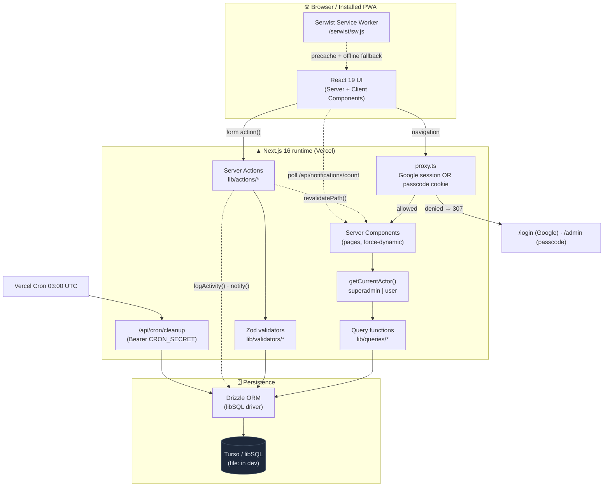
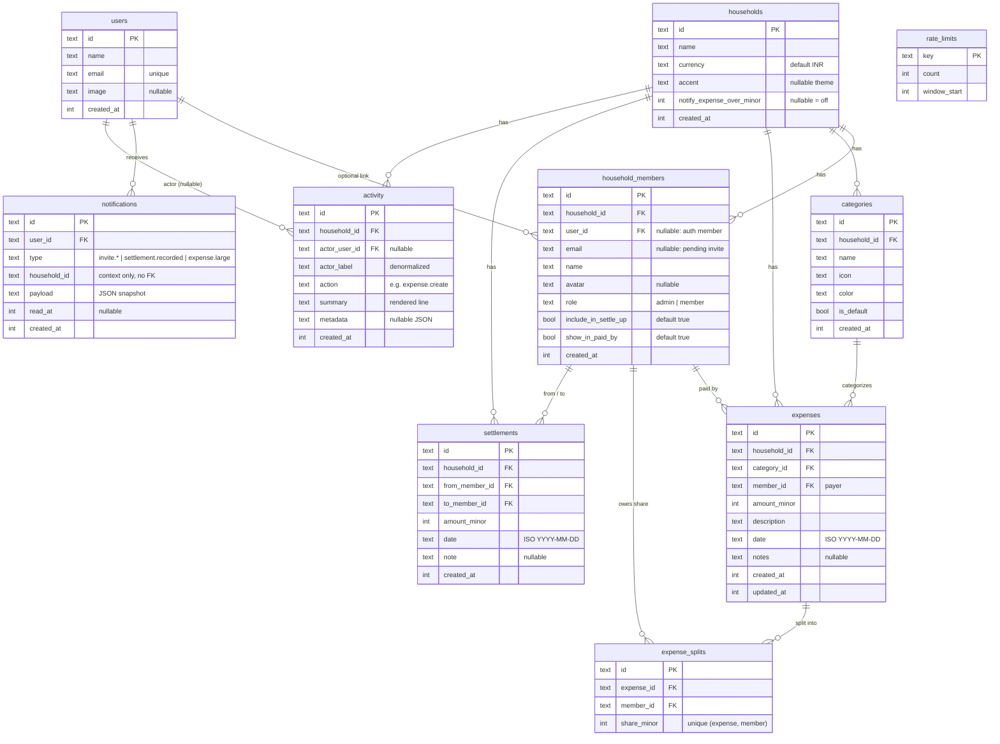
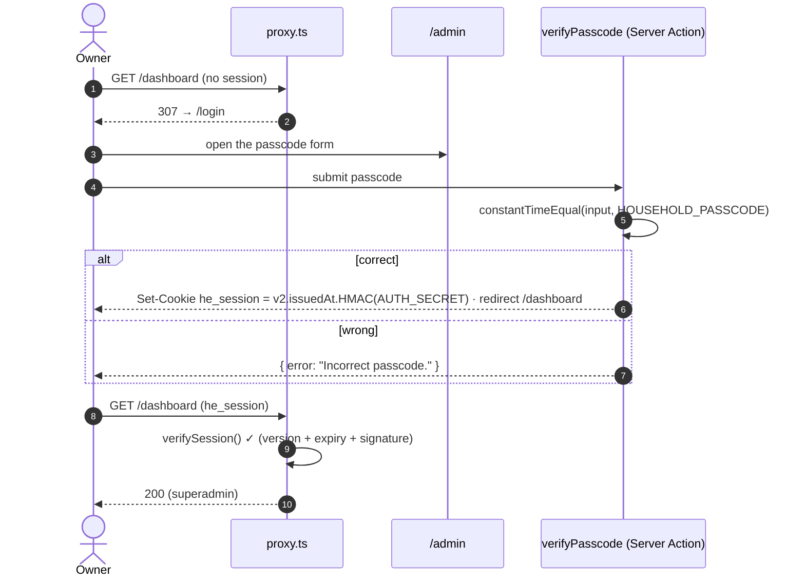

# Outlay

[](https://github.com/mangatinanda/outlay/actions/workflows/ci.yml)

A collaborative household expense‑tracking **Progressive Web App**. Everyone in a home logs
shared expenses, organizes them by category and person, sees where the money goes on a
charts‑driven dashboard, and settles up who owes whom — installable to a phone home screen
and usable offline.

> **Status:** live on Vercel + Turso. Households are **per‑user** ("Model B"): a Google
> account only sees the households it belongs to, invites are claimed by email on the next
> sign‑in, and a single owner‑only passcode at `/admin` grants a superadmin view across all
> households. Expenses can be split equally (the default) or by hand; balances, settlements,
> an activity feed and in‑app notifications are all in.
>
> What the app does, in plain language for the people using it: [`FEATURES.md`](FEATURES.md).

---

## Table of Contents

- [Features](#features)
- [Tech Stack](#tech-stack)
- [Architecture](#architecture)
  - [System Overview](#system-overview)
  - [Data Model](#data-model)
  - [Request & Mutation Lifecycle](#request--mutation-lifecycle)
  - [Access Model](#access-model)
  - [Settle‑up Math](#settle-up-math)
- [Project Structure](#project-structure)
- [Getting Started](#getting-started)
- [Database & Migrations](#database--migrations)
- [API Reference (Server Actions & Queries)](#api-reference-server-actions--queries)
- [HTTP Routes](#http-routes)
- [Environment Variables](#environment-variables)
- [Deployment](#deployment)
- [Testing & CI](#testing--ci)
- [PWA / Offline](#pwa--offline)
- [Scripts](#scripts)
- [Documentation Map](#documentation-map)
- [Roadmap](#roadmap)

---

## Features

| Area | Capability |
|---|---|
| **Dashboard** | This month's total and change vs last month, expense count, daily average; 30‑day spending bar chart; category donut; per‑member bar chart; recent expenses. |
| **Expenses** | Create / edit / delete (swipe‑to‑delete on mobile); date‑grouped list; **filters in the URL** (search, date range with presets, category, payer) so a view survives refresh and can be shared; **CSV import** with column detection, category suggestions and duplicate skipping; **export** of exactly the filtered rows to CSV, Excel or PDF. |
| **Splits** | Any expense can be split **equally** (default, no extra data) or **by hand** — pick who is in and adjust each share; the form keeps the shares adding up and the list tags hand‑split expenses. |
| **Settle up** | Per‑member net balances computed on read, the smallest set of payments that squares everyone (greedy), one‑tap "Settle up" to record a payment, edit or delete recorded payments, per‑member **include in settle‑up** toggle. |
| **Activity** | Append‑only audit feed of every change (who, what, when), grouped by day, with "show more" and a **who‑did‑it** filter in the URL. |
| **Notifications** | Bell with an unread badge that polls while the tab is visible; invites received / accepted / declined, payments recorded, and expenses over an admin‑set threshold; accept or decline an invite from the bell; unread items highlighted; `/notifications` history. |
| **Categories** | Icon + color per category, default set seeded per household, per‑category counts; a category with expenses can't be deleted. |
| **Members** | Roles (`admin` / `member`), optional email, **show in "Paid by"** and **include in settle‑up** toggles, attribution‑only people who never sign in; **invite by email** from `/members` (claimed on the invitee's next sign‑in); deletion is refused while any expense, split share or settlement references the member. |
| **Households** | Several households per user, each with its own currency and accent theme; create / rename / delete / switch and pick the accent on `/households`; currency and the large‑expense alert threshold live in Settings. |
| **Access** | Google sign‑in (Auth.js v5) scoped by membership, plus an owner‑only superadmin passcode at `/admin`; "Lock admin" drops the elevation without signing out of Google. Every mutation is scoped to the active household. |
| **Guardrails** | Caps on users, households per user and expenses per household; per‑household write rate limits; a daily cron that removes abandoned, empty accounts. |
| **PWA / Theming** | Installable, offline fallback via a Serwist service worker; light / dark / system; the "Fresh Ledger" design system (OKLCH tokens, reduced‑motion aware). |

---

## Tech Stack

| Layer | Technology |
|---|---|
| Framework | **Next.js 16** (App Router, React 19, Server Components, Server Actions, Turbopack) |
| Language | **TypeScript 6** (strict) |
| Styling | **Tailwind CSS v4** + **shadcn/ui** (base‑nova style, OKLCH tokens) on **Base UI 1.5**; animation via **motion** (`motion/react`) |
| Database | **Turso / libSQL** through **Drizzle ORM** (`drizzle-orm/libsql`) — local dev uses a `file:` SQLite DB through the same driver |
| Auth | **Auth.js v5** (Google, JWT sessions) + a Web Crypto HMAC passcode gate |
| Validation | **Zod v4** |
| Charts | **Recharts 3** |
| Import / export | CSV parsing in‑house; **exceljs** (Excel) and **jsPDF** (PDF) |
| Lint / format | **Biome 2** (replaces ESLint + Prettier), enforced by a lint‑staged pre‑commit hook |
| Tests | **Vitest** (unit + integration on in‑memory libSQL) and **Playwright** (mobile e2e) |
| PWA | **@serwist/turbopack** (service worker + offline fallback) |
| Dates / IDs | **date-fns v4**, **cuid2** |

---

## Architecture

Outlay follows the Next.js App Router data‑flow convention: **reads** happen in Server
Components via `lib/queries`, and **writes** happen through Server Actions in `lib/actions`
(Zod‑validated, household‑scoped, then `revalidatePath`). There are no REST/CRUD API routes;
the three API routes that exist are Auth.js, the bell's unread‑count poll, and the cleanup cron.

### System Overview


```mermaid
flowchart TB
    subgraph Client["🌐 Browser / Installed PWA"]
        UI["React 19 UI<br/>(Server + Client Components)"]
        SW["Serwist Service Worker<br/>/serwist/sw.js"]
    end

    subgraph Next["▲ Next.js 16 runtime (Vercel)"]
        PROXY["proxy.ts<br/>Google session OR passcode cookie"]
        ACTOR["getCurrentActor()<br/>superadmin | user"]
        RSC["Server Components<br/>(pages, force-dynamic)"]
        SA["Server Actions<br/>lib/actions/*"]
        VAL["Zod validators<br/>lib/validators/*"]
        QRY["Query functions<br/>lib/queries/*"]
        CRON["/api/cron/cleanup<br/>(Bearer CRON_SECRET)"]
    end

    subgraph Data["🗄️ Persistence"]
        ORM["Drizzle ORM<br/>(libSQL driver)"]
        DB[("Turso / libSQL<br/>(file: in dev)")]
    end

    UI -->|"navigation"| PROXY
    PROXY -->|"allowed"| RSC
    PROXY -->|"denied → 307"| LOGIN["/login (Google) · /admin (passcode)"]
    RSC --> ACTOR --> QRY --> ORM --> DB
    UI -->|"form action()"| SA --> VAL --> ORM
    SA -.->|"logActivity() · notify()"| ORM
    SA -.->|"revalidatePath()"| RSC
    UI -.->|"poll /api/notifications/count"| RSC
    VERCEL["Vercel Cron 03:00 UTC"] --> CRON --> ORM
    SW -.->|"precache + offline fallback"| UI

    classDef db fill:#1e293b,stroke:#475569,color:#e2e8f0;
    class DB db;
```

### Data Model

Ten tables, all with `cuid2` string primary keys and integer (Unix‑epoch) timestamps. Money is
stored as **integer minor units** (`amount_minor`, `share_minor`; scale 100) and converted to
major units once, at the query boundary. `expenses` is the hub; `expense_splits` holds a
hand‑made split (an expense with no rows is split equally); `settlements` and `activity` back
settle‑up and the audit feed; `notifications` is per user.


```mermaid
erDiagram
    users ||--o{ household_members : "optional link"
    users ||--o{ notifications : "receives"
    users ||--o{ activity : "actor (nullable)"
    households ||--o{ household_members : "has"
    households ||--o{ categories : "has"
    households ||--o{ expenses : "has"
    households ||--o{ settlements : "has"
    households ||--o{ activity : "has"
    categories ||--o{ expenses : "categorizes"
    household_members ||--o{ expenses : "paid by"
    household_members ||--o{ expense_splits : "owes share"
    household_members ||--o{ settlements : "from / to"
    expenses ||--o{ expense_splits : "split into"

    users {
        text id PK
        text name
        text email "unique"
        text image "nullable"
        int  created_at
    }
    households {
        text id PK
        text name
        text currency "default INR"
        text accent "nullable theme"
        int  notify_expense_over_minor "nullable = off"
        int  created_at
    }
    household_members {
        text id PK
        text household_id FK
        text user_id FK "nullable: auth member"
        text email "nullable: pending invite"
        text name
        text avatar "nullable"
        text role "admin | member"
        bool include_in_settle_up "default true"
        bool show_in_paid_by "default true"
        int  created_at
    }
    categories {
        text id PK
        text household_id FK
        text name
        text icon
        text color
        bool is_default
        int  created_at
    }
    expenses {
        text id PK
        text household_id FK
        text category_id FK
        text member_id FK "payer"
        int  amount_minor
        text description
        text date "ISO YYYY-MM-DD"
        text notes "nullable"
        int  created_at
        int  updated_at
    }
    expense_splits {
        text id PK
        text expense_id FK
        text member_id FK
        int  share_minor "unique (expense, member)"
    }
    settlements {
        text id PK
        text household_id FK
        text from_member_id FK
        text to_member_id FK
        int  amount_minor
        text date "ISO YYYY-MM-DD"
        text note "nullable"
        int  created_at
    }
    activity {
        text id PK
        text household_id FK
        text actor_user_id FK "nullable"
        text actor_label "denormalized"
        text action "e.g. expense.create"
        text summary "rendered line"
        text metadata "nullable JSON"
        int  created_at
    }
    notifications {
        text id PK
        text user_id FK
        text type "invite.* | settlement.recorded | expense.large"
        text household_id "context only, no FK"
        text payload "JSON snapshot"
        int  read_at "nullable"
        int  created_at
    }
    rate_limits {
        text key PK
        int  count
        int  window_start
    }
```

### Request & Mutation Lifecycle

```mermaid
sequenceDiagram
    autonumber
    actor User
    participant Proxy as proxy.ts (gate)
    participant Page as Server Component
    participant Actor as getCurrentActor()
    participant Query as lib/queries
    participant Action as lib/actions
    participant DB as Turso/libSQL

    Note over User,DB: Read (navigation)
    User->>Proxy: GET /dashboard (Google JWT or he_session cookie)
    Proxy->>Page: forward when either is valid
    Page->>Actor: superadmin (passcode) or user (Google)
    Page->>Query: getCurrentHousehold() — scoped to the actor's memberships
    Query->>DB: SELECT … (Drizzle)
    DB-->>Page: rows (major units)
    Page-->>User: streamed HTML

    Note over User,DB: Write (form submit)
    User->>Action: createExpense(FormData)
    Action->>Action: zod.safeParse() → {error} on fail
    Action->>Action: household + ownership + split checks
    Action->>DB: db.batch([INSERT expense, INSERT split rows])
    Action->>DB: logActivity() (best-effort) · notify() (if over threshold)
    Action->>Page: revalidatePath('/dashboard', '/expenses', '/settle-up', '/activity')
    Action-->>User: { success: true }
```

### Access Model

Every request resolves to **one principal** via `getCurrentActor()` (`src/lib/auth/actor.ts`):

| Principal | How | Sees |
|---|---|---|
| **user** | Google sign‑in at `/login` (Auth.js v5, JWT carrying `user.id`). Eligible when allow‑listed (`HOUSEHOLD_ALLOWED_EMAILS`, fails closed in production) **or** already a member / invitee of some household. Persisted on first sign‑in; pending invites are claimed by email. | Only households with a `household_members.user_id` row for them. Enforced in `getCurrentHousehold`, `listHouseholds`, `switchHousehold` and `assertCanAccessHousehold`. |
| **superadmin** | The owner‑only passcode at `/admin`. Sets the `he_session` cookie `v2.<issued‑at>.<HMAC‑SHA256>` (Web Crypto, `AUTH_SECRET`, 30‑day expiry, version‑bumped to invalidate old cookies). | Every household. "Lock admin" in the avatar menu drops the cookie and returns to the Google identity; "Sign out" clears both. |

`proxy.ts` (Next.js 16's renamed middleware, Node runtime) guards every route except `/login`,
`/admin`, the Auth.js endpoints, the cron endpoint (which has its own bearer token), the offline
page, Next internals and static files. A user with no households still enters the app shell and
sees an empty state with a "Create household" call to action on each page.


```mermaid
sequenceDiagram
    autonumber
    actor Owner
    participant Proxy as proxy.ts
    participant Admin as /admin
    participant Verify as verifyPasscode (Server Action)

    Owner->>Proxy: GET /dashboard (no session)
    Proxy-->>Owner: 307 → /login
    Owner->>Admin: open the passcode form
    Owner->>Verify: submit passcode
    Verify->>Verify: constantTimeEqual(input, HOUSEHOLD_PASSCODE)
    alt correct
        Verify-->>Owner: Set-Cookie he_session = v2.issuedAt.HMAC(AUTH_SECRET) · redirect /dashboard
    else wrong
        Verify-->>Owner: { error: "Incorrect passcode." }
    end
    Owner->>Proxy: GET /dashboard (he_session)
    Proxy->>Proxy: verifySession() ✓ (version + expiry + signature)
    Proxy-->>Owner: 200 (superadmin)
```

### Settle‑up Math

Balances are **computed on read** (`getSettleUp` + the pure functions in
`src/lib/settle-up/balances.ts`), never stored, so changing the rules needs no migration.

```
participants  = members with include_in_settle_up = true
equal pool    = Σ amount of participant‑paid expenses that have NO expense_splits rows
share(p)      = p's equal slice of the pool (remainder paise dealt one at a time, by id)
              + Σ share_minor of p's expense_splits rows (participant‑paid expenses only)
net(p)        = paid(p) − share(p) + settled_out(p) − settled_in(p)
suggestions   = greedy pairing of the largest creditor with the largest debtor (≤ n − 1 transfers)
```

Rules that keep this consistent: a split's payer and every share holder must be participants;
a member holding a share can be neither deleted nor toggled out of settle‑up; expenses paid by
non‑participants are ignored entirely. The include‑in‑settle‑up toggle is retroactive by design.

---

## Project Structure

```
src/
├── app/
│   ├── (auth)/login/           # Google sign-in
│   ├── (auth)/admin/           # owner-only passcode gate (superadmin)
│   ├── (app)/                  # gated app (force-dynamic layout)
│   │   ├── dashboard/          # charts + summary
│   │   ├── expenses/           # list (URL filters) · new · [id]/edit · import
│   │   ├── settle-up/          # balances · suggested payments · settlement history
│   │   ├── activity/           # audit feed (?actor= filter)
│   │   ├── notifications/      # notification history
│   │   ├── categories/ members/ households/ settings/
│   ├── api/auth/[...nextauth]/ # Auth.js route handlers
│   ├── api/notifications/count # unread badge poll (JSON)
│   ├── api/cron/cleanup/       # daily abandoned-account cleanup (Vercel Cron)
│   ├── serwist/[path]/         # service-worker route handler
│   ├── ~offline/               # precached offline fallback
│   └── layout.tsx              # root layout + providers
├── components/
│   ├── ui/                     # shadcn / Base UI primitives (CLI-managed, never hand-edited)
│   ├── motion/                 # reduced-motion-aware animation primitives
│   ├── layout/ dashboard/ expenses/ settle-up/ activity/ notifications/
│   ├── categories/ members/ households/ settings/ providers/ shared/ auth/ pwa/
├── lib/
│   ├── db/                     # Drizzle schema, libSQL connection (lazy during build), seed
│   ├── auth/                   # actor resolver, membership guards, user persistence
│   ├── queries/                # READ functions (Server Components)
│   ├── actions/                # WRITE Server Actions (safeAction-wrapped)
│   ├── validators/             # Zod schemas + URL-filter parsers
│   ├── settle-up/balances.ts   # pure balance math + debt simplification
│   ├── import/ export/         # CSV parse/match; CSV / Excel / PDF export
│   ├── activity.ts             # best-effort audit logger
│   ├── notifications.ts        # notification types + emitter
│   ├── limits.ts rate-limit.ts cleanup.ts
│   ├── gate.ts                 # Web Crypto HMAC sign/verify (versioned, expiring)
│   ├── allow-list.ts           # Google sign-in allow-list (fails closed in prod)
│   └── money.ts                # integer minor-unit helpers
├── auth.ts                     # Auth.js v5 config (Google provider)
└── proxy.ts                    # access gate (Next 16 proxy)
e2e/                            # Playwright specs (mobile project)
drizzle/                        # generated SQL migrations (0000 … 0009)
scripts/                        # seed, e2e DB reset, migrate-if-prod, Model B owner backfill
docs/superpowers/{specs,plans}/ # design specs + implementation plans per feature
.github/workflows/ci.yml        # CI: lint · typecheck · test · build, then e2e
```

---

## Getting Started

Requires **pnpm** and **Node 24+** (see `engines` in `package.json`).

```bash
pnpm install
cp .env.example .env.local        # set AUTH_SECRET, HOUSEHOLD_PASSCODE, Google OAuth vars
pnpm db:init                      # apply migrations + seed a sample household
pnpm dev                          # http://localhost:3000
```

Two ways in:

- **Owner / superadmin:** open `/admin` and enter `HOUSEHOLD_PASSCODE`. You see every
  household, including the seeded one.
- **Everyday user:** sign in with Google at `/login`. This needs `AUTH_GOOGLE_ID` /
  `AUTH_GOOGLE_SECRET` and your email in `HOUSEHOLD_ALLOWED_EMAILS` (in development an empty
  allow‑list lets everyone in). A new Google user has no households yet — create one from the
  empty state or accept an invite.

The local database is a SQLite file at `data/expense.db` (gitignored), accessed through the
libSQL driver.

---

## Database & Migrations

- **Schema:** `src/lib/db/schema.ts` (Drizzle `sqlite-core`) — single source of truth.
- **Migrations:** generated into `drizzle/` with `pnpm db:generate`, applied with
  `pnpm db:migrate`. **Production applies them automatically:** `pnpm build` runs
  `scripts/migrate-if-prod.mjs` first, and a failed migration fails the build.
- **Seed:** `pnpm db:seed` runs `scripts/seed.ts` (idempotent — skips if a household exists).
- **Driver:** one driver for both worlds — `file:./data/expense.db` locally, `libsql://…` plus
  an auth token in production. During `next build` the client is created lazily, so a build
  without a reachable database (CI, Vercel previews) still succeeds.
- **One‑off:** `pnpm db:migrate:model-b` backfills the owner's membership rows after the Model B
  cut (already run in production).

> Pages that read the database export `dynamic = "force-dynamic"` (via the `(app)` layout), so
> the build never renders against the database.

---

## API Reference (Server Actions & Queries)

> **There is no REST API** for app data. Mutations are **Server Actions** (`"use server"`),
> invoked from client components via the form `action` prop or a direct call; reads are plain
> async functions called inside Server Components. Every mutation validates with Zod, is
> **scoped to the active household** (a foreign id yields `{ error }`, never a leak), and
> returns `{ success: true }` or `{ error: string }` — infrastructure failures are caught by
> the `safeAction` wrapper and returned as `{ error }` too. Amounts are stored as integer minor
> units (scale 100); queries return major units.

### Mutations — `src/lib/actions/`

| Action | Signature | Input | Notes |
|---|---|---|---|
| `createExpense` | `(formData)` | `amount, description, categoryId, memberId, date, notes?, splits?` | `splits` is a JSON array of `{ memberId, amount }` that must sum to `amount`; absent = equal split. Emits `expense.large` when over the household threshold. |
| `updateExpense` | `(id, formData)` | same as create | Replaces split rows wholesale; no `splits` clears them. |
| `deleteExpense` | `(id)` | — | Deletes split rows with the expense (one batch). |
| `importExpenses` | `(payload)` | `{ rows[], memberResolutions }` | Client‑normalized CSV rows; creates missing categories, skips duplicates; rate‑limited. |
| `createCategory` / `updateCategory` / `deleteCategory` | `(formData)` / `(id, formData)` / `(id)` | `name, icon, color` | Delete is refused while expenses use the category. |
| `createMember` / `updateMember` / `deleteMember` | `(formData)` / `(id, formData)` / `(id)` | `name, email?, role, includeInSettleUp, showInPaidBy` | Delete (and toggling out of settle‑up) is refused while expenses, split shares or settlements reference the member. |
| `inviteToHousehold` | `(formData)` | `email` | Creates a pending member row; claimed on the invitee's next sign‑in; notifies them. |
| `acceptInvite` / `declineInvite` | `(memberId)` | — | Caller's own pending invite only; decline is refused while ledger rows reference the row. |
| `createHousehold` / `renameHousehold` / `deleteHousehold` | `(formData)` / `(id, formData)` / `(id)` | `name, currency?` | Creator becomes an admin member; delete cascades in FK order and is refused for the last household. |
| `switchHousehold` | `(id)` | — | Sets the `he_household` cookie (membership‑checked). |
| `updateHouseholdCurrency` | `(currency)` | ISO code | |
| `updateHouseholdAccent` | `(householdId, accent \| null)` | accent id | Per‑household theme. |
| `updateExpenseNotifyThreshold` | `(formData)` | `amount` (empty/0 = off) | Admins only. |
| `createSettlement` / `updateSettlement` / `deleteSettlement` | `(formData)` / `(id, formData)` / `(id)` | `fromMemberId, toMemberId, amount, date, note?` | Both members must be in settle‑up (an unchanged member is accepted on edit); recording notifies the counterparty. |
| `loadMoreActivity` | `(beforeMs, actor?)` | cursor | "Show more" for the feed. |
| `loadNotifications` / `markAllNotificationsRead` | `()` | — | Current user only. |
| `verifyPasscode` | `(prevState, formData)` | `passcode` | Sets `he_session` and redirects. |
| `lockAdmin` / `logout` | `()` | — | Drop the passcode cookie only / sign out of both. |

**Validation schemas** (`src/lib/validators/`): `expenseSchema` (amount > 0, ≤ 100M, ≤ 2
decimals; description 1–200; ISO date; notes ≤ 500), `parseSplitsField` (shares ≥ 0, unique
members, exact sum), `settlementSchema`, `categorySchema`, `memberSchema`, `householdSchema`,
`currencySchema`, `expenseNotifyThresholdSchema`, `accentSchema`, `inviteSchema`,
`importPayloadSchema`, and the URL parsers `parseExpenseFilters` / `parseActorFilter`
(malformed query strings degrade to "no filter").

### Reads — `src/lib/queries/`

| Function | Returns |
|---|---|
| `getCurrentHousehold()` / `listHouseholds()` | the active household (cookie, membership‑checked, falling back to the first) / the actor's households — both React `cache()`d |
| `getExpenses(householdId, filters?)` | expenses joined with category + payer, `hasCustomSplit`; filters: `categoryId`, `memberId`, `startDate`, `endDate`, `search`, `limit` |
| `getExpenseById(id, householdId)` | one expense with joins plus its `splits` (major units) |
| `getCategories()` / `getCategoriesWithCount()` | categories, optionally with expense counts |
| `getMembers()` / `getMembersWithStats()` | members, optionally with count + total paid |
| `getSettleUp(householdId)` | balances, suggested transfers, `settledUp` |
| `getSettlements(householdId)` | settlement history with member ids + names |
| `getActivity(householdId, { before?, limit?, actor? })` / `getActivityActors()` | feed rows / distinct actor labels (A→Z, case‑insensitive) |
| `getUnreadCount()` / `listNotifications(limit?)` | for the current user; invite state resolved live |
| `memberLedgerReference(memberId)` / `memberHasSplitShares(memberId)` | which ledger table still references a member (`expenses` \| `splits` \| `settlements`) |
| `getDashboardStats()` · `getCategoryBreakdown()` · `getSpendingByDay()` · `getMemberSpending()` · `getRecentExpenses()` | dashboard aggregates |

---

## HTTP Routes

| Method | Path | Purpose |
|---|---|---|
| `GET`/`POST` | `/api/auth/*` | Auth.js v5 endpoints (Google OAuth round‑trip, session, CSRF). |
| `GET` | `/api/notifications/count` | `{ count }` of unread notifications for the current user; polled by the bell every 60 s while the tab is visible. |
| `GET` | `/api/cron/cleanup` | Removes abandoned accounts and provably empty households. Requires `Authorization: Bearer <CRON_SECRET>`; scheduled daily at 03:00 UTC by `vercel.json`. |
| `GET` | `/serwist/sw.js` | The bundled Serwist service worker (and source map), registered from the root layout. |

All other URLs are App Router pages, gated by `proxy.ts`.

---

## Environment Variables

See `.env.example` for the full annotated list.

| Variable | Scope | Description |
|---|---|---|
| `DATABASE_URL` | all | `file:./data/expense.db` locally (the `file:` prefix is required); `libsql://<db>.turso.io` in production. |
| `TURSO_AUTH_TOKEN` | production | Turso database auth token. |
| `AUTH_SECRET` | all | Signs both the passcode cookie and the Auth.js JWT (`openssl rand -base64 32`). |
| `HOUSEHOLD_PASSCODE` | all | The **owner‑only superadmin** passcode entered at `/admin`. |
| `AUTH_GOOGLE_ID` / `AUTH_GOOGLE_SECRET` | all | Google OAuth client (redirect URI `<origin>/api/auth/callback/google`). |
| `HOUSEHOLD_ALLOWED_EMAILS` | all | Comma‑separated Google emails allowed to sign in. Empty in production = nobody (fails closed); empty in development = everyone; `*` opens sign‑up to any Google account. Members and invitees are always allowed. |
| `CRON_SECRET` | production | Bearer token Vercel Cron sends to `/api/cron/cleanup`; the route refuses everything else. |
| `CLEANUP_RETENTION_DAYS` | optional | Days an account may sit empty before cleanup (default 30). |
| `MAX_USERS`, `MAX_HOUSEHOLDS_PER_USER`, `MAX_EXPENSES_PER_HOUSEHOLD` | optional | Growth caps (defaults 1000 / 10 / 50 000). |
| `RATE_LIMIT_EXPENSES_PER_MIN`, `RATE_LIMIT_HOUSEHOLDS_PER_HOUR`, `RATE_LIMIT_IMPORTS_PER_HOUR`, `RATE_LIMIT_DISABLED` | optional | Write rate limits (defaults 60 / 10 / 5); `RATE_LIMIT_DISABLED=1` turns the layer off. |

---

## Deployment

Target: **Vercel** + **Turso**. Pushes to `main` auto‑deploy.

```bash
# 1. Provision a Turso database, capture its URL + token
turso db create outlay
turso db show outlay --url
turso db tokens create outlay

# 2. Set the env vars above in Vercel (Production); Preview needs them too for a
#    runnable preview, though the build itself succeeds without a database.

# 3. Deploy — the production build applies pending migrations, then builds
vercel --prod
```

Because DB‑backed pages are `force-dynamic`, the build never renders against the database; it
migrates it and then serves pages per request. The Google consent screen must list each family
member as a test user (or be published) before they can sign in.

---

## Testing & CI

- **Vitest** (`pnpm test`): unit tests for the money, gate, balance and validator logic, and
  integration tests that run the real Server Actions and queries against an **in‑memory libSQL**
  database with the actual migrations (only `next/headers`, `next/cache` and the actor resolver
  are mocked). Component tests use Testing Library under happy‑dom.
- **Playwright** (`pnpm test:e2e`): one **mobile** project (Pixel 7). The web server step
  resets, migrates and seeds a dedicated `data/e2e.db`, then builds and starts the app.
  Specs use the passcode path only (Google needs a real IdP) and never assert
  `getByRole("alert")` — the App Router's route announcer collides with it
  (`.claude/rules/playwright.md`).
- **CI** (`.github/workflows/ci.yml`): `ci` job — Biome, `tsc --noEmit`, Vitest, production
  build; `e2e` job — Playwright on Chromium, report uploaded on failure. A lint‑staged pre‑commit
  hook runs Biome and the type‑check on staged files.

---

## PWA / Offline

- Service worker built by **@serwist/turbopack** (works with the default Turbopack build — no
  webpack), served from `/serwist/sw.js`. The notifications poll is `NetworkOnly`.
- `defaultCache` runtime caching + a precached `/~offline` fallback for uncached navigations.
- Web App Manifest and maskable icons live in `public/` (`pnpm gen:icons` regenerates them).
  The app is installable on desktop and mobile; previously visited pages remain available
  offline.

---

## Scripts

| Command | Description |
|---|---|
| `pnpm dev` | Dev server (Turbopack) |
| `pnpm build` | Apply pending migrations in production, then production build |
| `pnpm start` | Run the production build |
| `pnpm lint` / `pnpm format` | Biome check / Biome format |
| `pnpm test` / `pnpm test:watch` | Vitest (also run in CI) |
| `pnpm test:e2e` | Playwright e2e (builds + starts the app on a seeded e2e DB) |
| `pnpm db:generate` / `pnpm db:migrate` / `pnpm db:push` | Drizzle migrations |
| `pnpm db:seed` / `pnpm db:init` | Seed sample data / migrate + seed |
| `pnpm db:e2e` / `pnpm db:e2e:reset` | Prepare / reset the e2e database |
| `pnpm db:migrate:model-b` | One‑off owner backfill for the Model B cut |
| `pnpm gen:icons` | Regenerate PWA icons |

---

## Documentation Map

| File | Audience | What it holds |
|---|---|---|
| `README.md` | engineers | This overview: architecture, data model, API surface, ops. |
| `FEATURES.md` | end users | Everything the app can do, in plain language. Refreshed by the `features-doc` skill. |
| `CLAUDE.md`, `src/CLAUDE.md`, `src/lib/CLAUDE.md` | AI assistants + engineers | Durable conventions per directory. |
| `memory.md` | AI assistants + engineers | Evolving work log, key decisions, current state and open items. |
| `docs/superpowers/specs/` · `docs/superpowers/plans/` | engineers | Design spec and implementation plan per feature (Model B, settle‑up + activity, notifications, custom splits, deferred polish). |
| `.claude/rules/`, `.claude/skills/design-system/` | engineers | UI styling invariants, Playwright rules, the "Fresh Ledger" design system. |
| `docs/2026-06-11-repo-audit.md` | historical | The June 2026 audit that drove the hardening pass. |

---

## Roadmap

- An e2e spec for a hand‑split expense (today's e2e only submits the default equal split).
- Category budgets with an over‑budget notification.
- Recurring expenses (rent, subscriptions) created by a cron.
- A reports page beyond the 30‑day dashboard (month picker, year view, trends).
- Web push on top of the existing bell; receipt photos on expenses.
- Split data in CSV export / import (exports currently carry payer and amount only).
- Migrate Recharts `<Cell>` usage ahead of Recharts 4.

---

<sub>Architecture and data‑flow conventions are documented in the repo's `CLAUDE.md` files.</sub>
